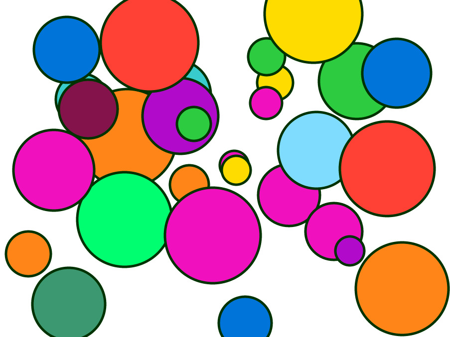

Grooscript grails 3 plugin demo
================

Just a grails 3 application, run it with **./gradlew run** and open your browser in http://localhost:8080
Draw circles where you click, send to all clients via websockets.

